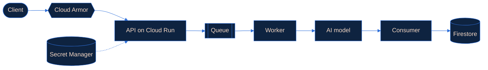

<div align="center">



<br/>

<a href="https://github.com/abdelrahman-alqudah">
  
</a>

<br/><br/>

<a href="https://abdelrahmanalqudah.dev"></a>
<a href="https://www.linkedin.com/in/abd-elarhman/"></a>
<a href="mailto:info@abdelrahmanalqudah.dev"></a>
<a href="https://github.com/abdelrahman-alqudah"></a>

</div>


```bash
$ whoami
→ Software engineer. I design APIs, data models, and the infrastructure around them.
  Security isn't a checklist at the end. It's in the schema and the access rules
  from the first draft.
```

## Currently building: U JO RESIDENT

An end-to-end platform on Firebase and GCP, designed around the failure case first. Slow or failing dependencies stay off the request path, and nothing sensitive ever reaches the client.



| Decision | Why |
| :-- | :-- |
| **Async pipeline** (queue → consumer) | One slow dependency can't take down the request path |
| **Firestore schema built around access patterns** | Security rules and queries shape the data model, not the other way round |
| **Cloud Run behind Cloud Armor** | Traffic is filtered at the edge before it reaches application code |
| **Secret Manager only** | Nothing sensitive in client code or in the repo |
| **AI calls routed through the API tier** | Model access is never exposed client-side |

## Tech stack

| | |
| :-- | :-- |
| **Backend** |       |
| **Languages** |       |
| **Data** |     |
| **Cloud** |      |
| **Delivery and security** |      |
| **Testing** |   |

## What I do

<table>
  <tr>
    <td width="50%" valign="top">
      <h3>Software engineering</h3>
      APIs with Laravel and ASP.NET Core, built for the failure case first.
    </td>
    <td width="50%" valign="top">
      <h3>System design</h3>
      Schemas, queues, and a clear line between cache and source of truth.
    </td>
  </tr>
  <tr>
    <td width="50%" valign="top">
      <h3>Infrastructure and security</h3>
      CI/CD, Cloud Armor, security rules, and secrets that live in a secrets manager instead of an <code>.env</code> committed by accident.
    </td>
    <td width="50%" valign="top">
      <h3>Database engineering</h3>
      PostgreSQL and Firestore schema design, query and index tuning, Redis caching.
    </td>
  </tr>
</table>

## GitHub stats

<div align="center">


</div>


## Contact

<div align="center">

Amman, Jordan &nbsp;·&nbsp; [info@abdelrahmanalqudah.dev](mailto:info@abdelrahmanalqudah.dev) &nbsp;·&nbsp; [abdelrahmanalqudah.dev](https://abdelrahmanalqudah.dev)

</div>

> [!NOTE]
> Open to software engineering roles in backend, APIs, and system design. Remote-first, open to discussion. I respond within 24 hours.

<div align="center">
  <sub>Building systems with precision and purpose.</sub>
</div>
